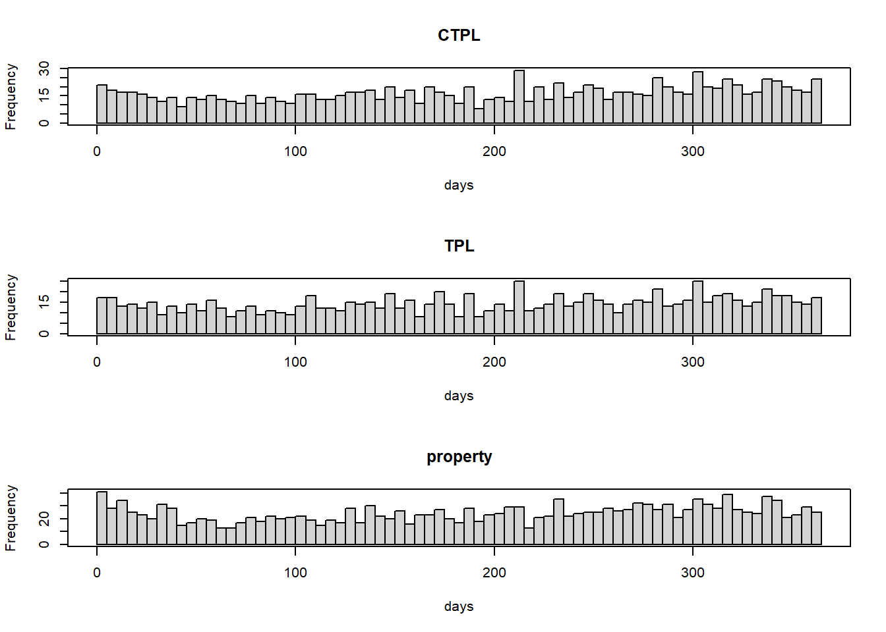
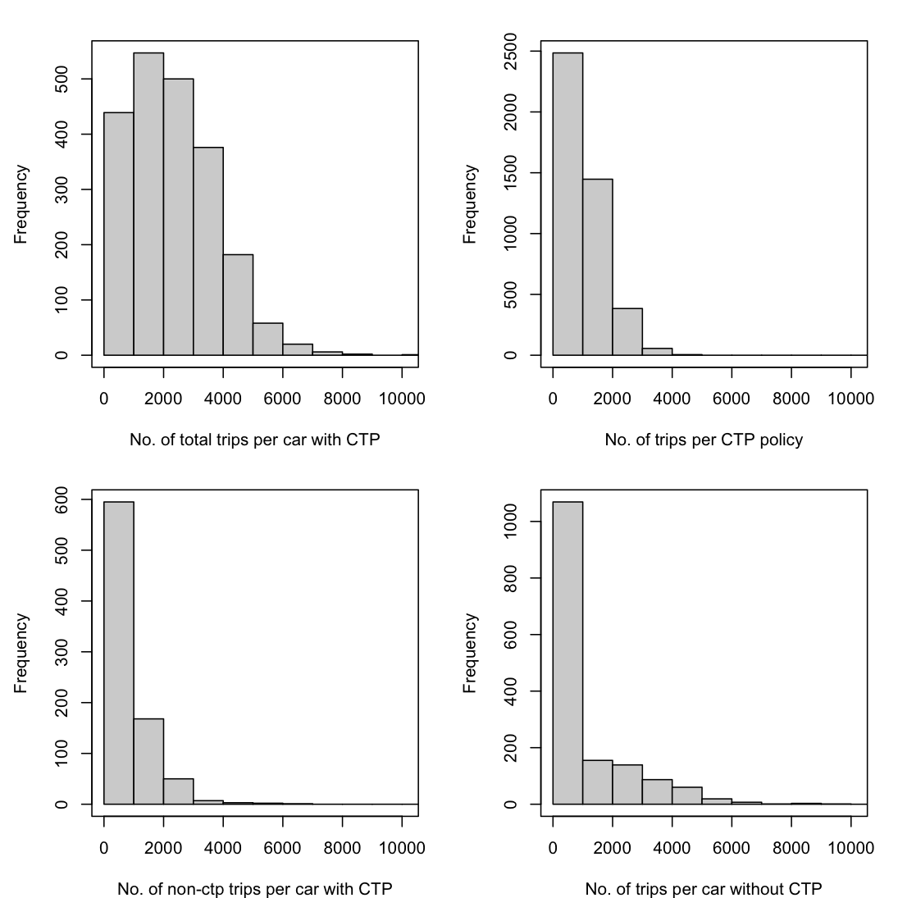

<!-- # (PART) PREPROCESS {-} -->

# Overview

From a Chinese domestic insurance company, we have obtained four data sets: (1) **the vehicle identification number data (VIN data)**, (2) **the policy data**, (3) **the claim data** and (4) **the telematics data**. 

VIN data (1) contains a mapping from the policy code `Policy_Code` to the vehicle identification numbers `Device_ID`.
We use (1) to aggregate policies of the same car driver and to link policy data (2) with telematics data (3).
We use (2) and (3) to create the claims frequency data. 
For the telematics data (4), more data cleaning and pre-processing are needed. 

## Vehicle identification number data

In the VIN data, we have 12196 policies on 2311 cars. 
So averagely one car has bought 5 policies. 
The cars are identified by the vehicle identification numbers (VINs). This data  establishes a mapping from the policies to the vehicle identification numbers.

## Policy data
 

There are two types of policies: **the compulsory third party liability (CTPL) policies** and **the commercial policies**.
While a CTPL policy has only one **CTPL coverage**, a commercial policy may have 7 coverages including **third party liability (TPL), property, driver, passengers, theft and robbery (TandR), glass and scratch**. 
We show the range of underwriting dates, policy inception dates and expiration dates in Table \@ref(tab:dates). 
Although not indicated by the insurance company,
the observation period should be from 2014-01-01 to 2017-06-30.

After removing the policies with zero premium, there are 6032 CTPL policies and 6005 commercial policies on the 2311 cars of the VIN data. 
Note that 159 policies in the VIN data are missed in the policy data. Also note that those  numbers may change during the data cleaning. 
The collecting information for the two types of policies are  different. In the next two chapters, we will discuss the two types of policies separately.

## Claim data

There are 1031 CTPL policies and 1690 commercial policies having made at least one claim. 
In the claim data, we have 1204 CTPL claims, and 2218 commercial claims.
Note that most policies do not incur a claim and a policy can incur more than one claims.
A CTPL claim contains only the CTPL coverage, while a commercial claim may contain up to 7 coverages.

We provide the range of accident dates, reporting dates and  claim closure dates in Table \@ref(tab:dates). The exposure period should be from 2014-01-01 to 2017-06-30. Note that 28 claims are still open on 2017-06-30.

Table: (\#tab:dates)The range of underwriting dates (`UNDERWRITEENDATE`), policy inception dates (`KINDSTARTDATE`), policy expiration dates (`DUEENDDATE`), accident dates (`DAMAGEDATE`), reporting dates (`REPORTDATE`) and the claim closure dates (`ENDCASEDATE`)

|dates             |min        |max        |
|:-----------------|:----------|:----------|
|UNDERWRITEENDDATE |2013-10-19 |2017-06-30 |
|KINDSTARTDATE     |2014-01-01 |2017-09-25 |
|DUEENDDATE        |2014-03-22 |2018-09-24 |
|DAMAGEDATE        |2014-01-09 |2017-06-29 |
|REPORTDATE        |2014-01-09 |2017-06-30 |
|ENDCASEDATE       |2014-01-20 |2017-06-30 |

Table \@ref(tab:zero-claim) shows the number of claims for each coverage. We also calculate the proportions of zero claims for each coverage. 
**Note that a large proportion of claims incurring the TPL coverage have zero TPL claims.**
Note that a claim incurring zero TPL claim does not necessarily incur zero claims for other coverages.

Table: (\#tab:zero-claim)The proportions of zero incurred claims

|coverages  | claims counts| zero claims| proportions of zero claims|
|:----------|-------------:|-----------:|--------------------------:|
|CTPL       |          1204|          57|                       0.05|
|TPL        |          1041|         775|                       0.74|
|property   |          1774|         236|                       0.13|
|driver     |             2|           1|                       0.50|
|passengers |             1|           0|                       0.00|
|TandR      |             1|           0|                       0.00|
|glass      |            34|           0|                       0.00|
|scratch    |            21|           0|                       0.00|

We calculate the reporting delay (report date - damage date) and payment delay (endcase date - report date) for each coverage in Table \@ref(tab:delay). Note that 99\% claims are reported within one week.

Table: (\#tab:delay)The 99% quantiles of reporting delay and payment delay.

|coverages  | Delay_Report| Delay_Payment|
|:----------|------------:|-------------:|
|CTPL       |            4|           194|
|TPL        |            4|           209|
|property   |            3|           145|
|driver     |            0|            34|
|passengers |            0|             2|
|TandR      |            0|            64|
|glass      |            3|             9|
|scratch    |            2|             1|

A question of interest is whether policyholders tend to file a claim at the end of policy duration. We draw the histogram of the days between the reporting and the expiration for three main coverages in Figure \@ref(fig:report-expiration). **Hence, policyholders do not tend to file a claim at the end of policy duration.**

(\#fig:report-expiration)The histograms of the days between the reporting and the expiration

## Telematics data

The telematics data is zipped by days from 2015/04/26 to 2017/07/08, i.e., a zipped folder contains all the trips of all the cars on that day. 
The daily telematics volume after 2015/08/13 is around 40 folds than that before 2015/08/13. The reason is that there is device installing rush in 2015/07/08. We save the telematics data before 2015/08/13 to the address `./telematics_data/Incomplete_before_2015_08_13/SUNSJRN_Date.00.zip`. 
We also have the *summary data* and *event data* for all the trips grouped by days. The *summary data* is used to validate the detailed telematics data and the *event data* records the pre-defined abnormal car moving events. We do not study these two data sets furthermore.

To be consistent with the claims frequency data where each row is for a policy, we group the telematics data by policies. We focus on the telematics data for **the compulsory policies**. 

We create a car folder `Device_ID` for each car and in this car folder we create a policy folder `Policy_Code` for each policy of this car. 
We extract all the trips of this car during this policy effective period, and save them into the corresponding policy folder (i.e., in the address of   `./telematics_data/compulsory_car/Device_ID/Policy_Code/Device_ID_Trip_Number.csv`). Note that a trip file is named as `Device_ID_Trip_Number.csv`. We will explain the `Trip_Number` later.
We save the trips not in any policies in a folder of `other_trips` under the car folder (i.e., in the address of `./telematics_data/compulsory_car/Device_ID/other_trips/Device_ID_Trip_Number.csv`).

We have 2296 cars with compulsory policies, in which 2131 cars have telematics data and 165 cars have no telematics data (i.e., 7% car folders `./telematics_data/compulsory_car/Device_ID/` contain zero telematics files).
There are 1527 *policies* having no telematics data, amounting for 26% of the total 5904 policies. The reason of this high missing percentage is that the policies' effective dates are ranging from 2014-01-01 to   2017-06-25 but **the telematics data is available for a shorter period from 2015/08/13 to 2017/07/08.**

**Therefore it is better to work on the aggregated policy data on cars.**
During the aggregation, we need to consider the change of driver which actually rarely happen. By working on the aggregated policies on cars, we effectively interpolate the telematics covariates for policies before 2015-08-13 and only 7% cars miss the telematics covariates. 

Not all the car driving trips during the policy effective period are recorded, since the telematics data collecting devices may be installed anytime during the policy effective period. Therefore it is difficult to calculate the total driving distance during a policy period. **We will use average driving distance per day or average driving time per day instead.** 

In the following, we draw the distribution of trips: (top-left) the total trips per car with CTPL policies; (top-right) the trips per CTPL policy; (bottom-left) the trips per car with CTPL policies during no CTPL policies period; (bottom-right) the trips per car without CTPL policies. 

(\#fig:tele-summary)The distribution of number of trips

The telematics data of the 1541 cars without compulsory policies is saved in the folder `./telematics_data/non_CTP_trips` with the sub-folders `/Device_ID/Device_ID_Trip_Number.csv` denoting the cars.

