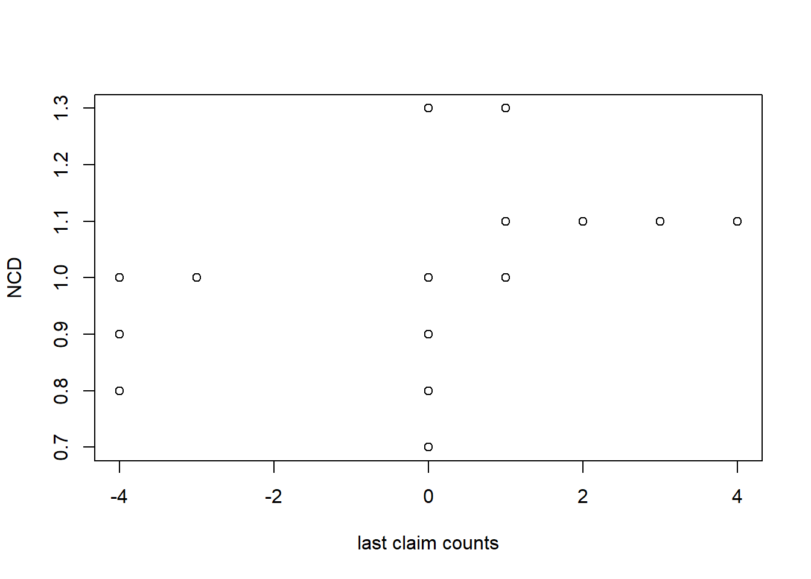
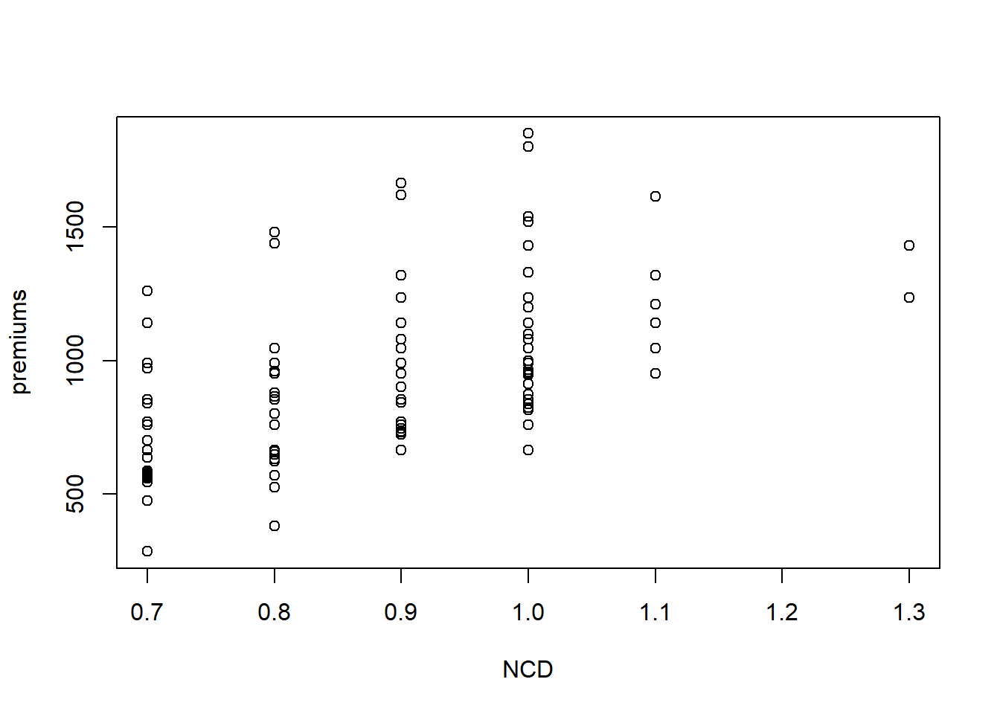
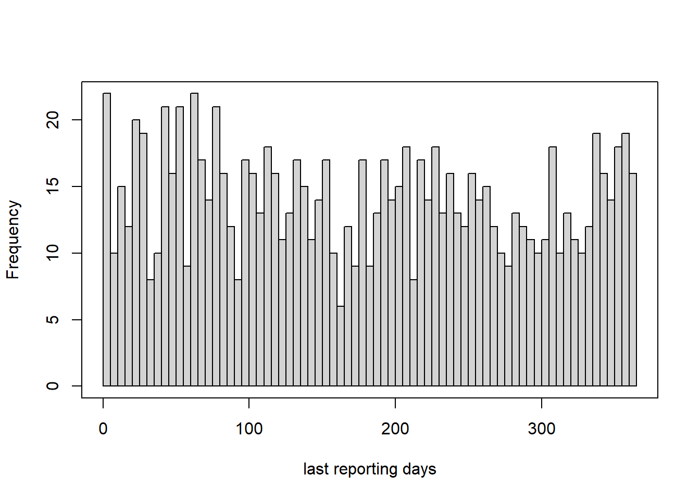

# Compulsory third party liability policies

In this section we construct the claims frequency data for the compulsory third party liability policies. We discuss the data cleaning and perform some preliminary summary analysis.
We establish the claims frequency of the CTPL policies using the policy data (6032 policies on 2298 cars) and the claim data (1204 claims). All the CTPL policies have one coverage of third party liability and have the same amount of insurance CNY 122000.
In 2021 all the Chinese insurance companies increase the CTPL AOI to CNY 200000.

## Data cleaning

There are 26 variables for each CTPL policy. We describe those variables and the pre-process procedure as follows. 

### Identification variables

Variables 1-2 are the identification variables.

1. `Device_ID` is used to match the frequency data with the telematics data.
2. `Policy_Code` identifies each policy. One car may have bought several policies, i.e., renewal policies for several years.

### Time 

Variables 3-5 are the time variables.

3. `KINDSTARTDATE` is the policy effective date ranging from 2014-01-01 to 2017-09-25.
4. `DUEENDDATE` is the policy expiring date ranging from 2014-09-02 to 2018-09-24.
5. `UNDERWRITEENDATE` is the underwriting date ranging from 2013-10-19 to 2017-06-30.

### Policy duration

Variable 6 is the policy duration. 

6. `YEARS` is the policy duration from `KINDSTARTDATE` to `DUEENDDATE`. There are 6 policies with less than 1 year policy duration (no claims made on these policies). We remove those policies, resulting all the policies with 1 year policy duration.

### Car features

Variables 7-11 are the car variables.

7. `PURCHASEPRICENOTAX` is the car purchase price, ranging from CNY25000 to CNY990000.
8. `SEATCOUNT` ranges from 2 to 8, and 96\% policies have 5 seats.
9. `CARBRAND` contains 67 car brands.
10. `CARSERIESNAME` contains 299 car series.
11. `USEYEARS` ranges from 0 to 14 years.

### Driver features

Variables 12-14 are the driver variables.

12. `BRANCHNAME` is the branch name selling the policy. It indicates the main area where the car is driven. There are 27 different branches.
13. `AGE` is the driver' age. After correcting for 6 driver's ages, the driver's age  ranges from 19 to 77 years old.
14. `SEX` is the driver's gender. The number of policies bought by males is nearly as double as the females.

### Experience rating factors

Variables 15-16 are the experience rating factors.

15. `LASTCLAIMCOUNT` is the number of claims in the previous year. It ranges from 0 to 4, with -3 indicating a new car and -4 indicating a new policy. 
We keep the 8 missing values since we will use the no-claim discount (NCD) factor instead. 
16. `NCD_Compulsory` is the no-claim discount (NCD) factor for the compulsory policies. 
It takes values from \{0.7, 0.8, 0.9, 1, 1.1, 1.3\}. 
The relationship between `LASTCLAIMCOUNT` and `NCD_Compulsory` is shown in Figure \@ref(fig:ncd).

(\#fig:ncd)Last claim count v.s. NCD

### Other policy features

Variable 17 is the policy type. Variable 18 is the coverage type. Variable 19 is the amount of insurance (AOI). Variable 20 is the indication of non-deductible. Variable 21-22 are the premium. 

17. `RISKCODE` indicates the type of policy, either the CTPL policy or the commercial policy.
18. `KINDCODE` indicates the coverages of the policy. For the CTPL policy, there is only one coverage, third party liability.
19. `AMOUNTNEW` is the amount of insurance (the coverage limit). We correct for two data errors. All the CTPL policies have the same coverage limit of CNY122000.
20. `FLAG` is the indication of non-deductible. We correct for one data error. All the CTPL policies are non-deductible.
21. `PREMIUM` is the premium for each coverage, ranging from CNY285 to CNY1850.
22. `PREMIUM_Total` is the total premium for all coverages. For the CTPL policies, it equals to `PREMIUM`. Figure \@ref(fig:premium) shows that generally the premiums increase with NCD factor.

(\#fig:premium)NCD v.s. Premiums

### Claims features

Variable 23-26 are the claim variables extracted from the claim data.

23. `Claim_Code` contains all the claim codes on this policy. Note that one policy may make several claims.
24. `Claim_Coverage` contains the incurred coverages of all the claims. For the CTPL policy, it is always the third party liability coverage.
25. `Claim_Amount` contains the incurred claims amount of each coverage of each claim.
26. `Claim_Count` is the number of claims made on this policy. This variable is the response variable in the claims frequency modelling.  

We show the distribution of last reporting dates (from policy inception) in Figure \@ref(fig:last-report), which indicates that the last reporting dates are distributed uniformly along the policy duration.
After the data cleaning, we have 6026 policies on 2296 cars in which 1204 claims are made by 1031 policies on 829 cars. 

(\#fig:last-report)The distribution of last reporting dates

Considering the report delay as shown in Table \@ref(tab:dates), we set the observed exposed period as from 2014-01-01 to 2017-06-25. **There are 122 policies outside the observed exposed period and 1614 policies are partially exposed.** The total claims count is 1204 and the total exposure is 5262. The claims frequency is 0.23 on those 5904 policies of 2296 cars. The claims frequency data of CTPL policies is saved as **`policy_compulsory.csv`**

## Policies aggregation w.r.t cars 

As we discussed before, there is a large proportion of policies ($26\%$) missing the telematics data. We aggregate policies with respect to the cars `Device_ID`. We need to check the cars with multiple drivers and implement appropriate data cleaning. We can detect the driver changes using the region, the age, and the gender.

There are 8 cars changing the region, 82 cars with drivers changing the gender and 87 cars with drivers changing the age for more times than the number of policies. We remove these cars. We set the age of drivers with multiple policies as the median of ages.

The car price `PURCHASEPRICENOTAX` is the market value which changes yearly, and we set it as the median. We set the use-years `USEYEARS`, the no-claim discount factor `NCD_Compulsory` as the mean. We calculate the total premium `PREMIUM_Total`, the total exposure `Earned_Years`, and the total claim counts `Claim_Count` for each car.

Finally we have removed 177 cars. The aggregation data contains 2119 cars with 4804 years-at-risk and 1059 claims. The empirical claims frequency is 0.22. The claims frequency data of cars is saved as **`car_compulsory.csv`.**

**Remarks**:  It may be that driver's information has changed for optimizing the insurance premium from a policyholder perspective. 
In a second stage one may analyze whether this change of policyholder is caused by an accident, i.e. whether there was an accident immediately before the change.
In a third stage we may test whether the driving behavior changes, i.e. is this really a change of car driver or only a change on paper (policy contract).
