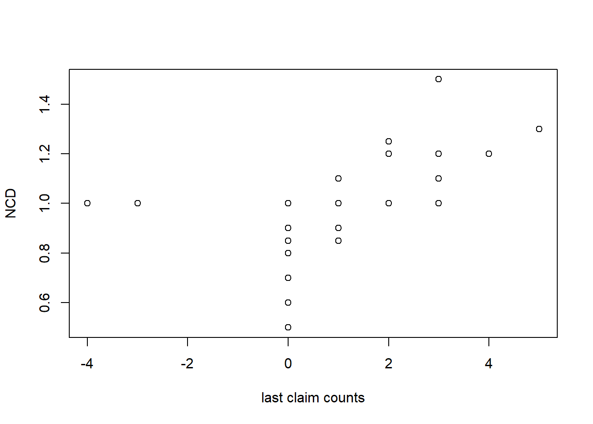
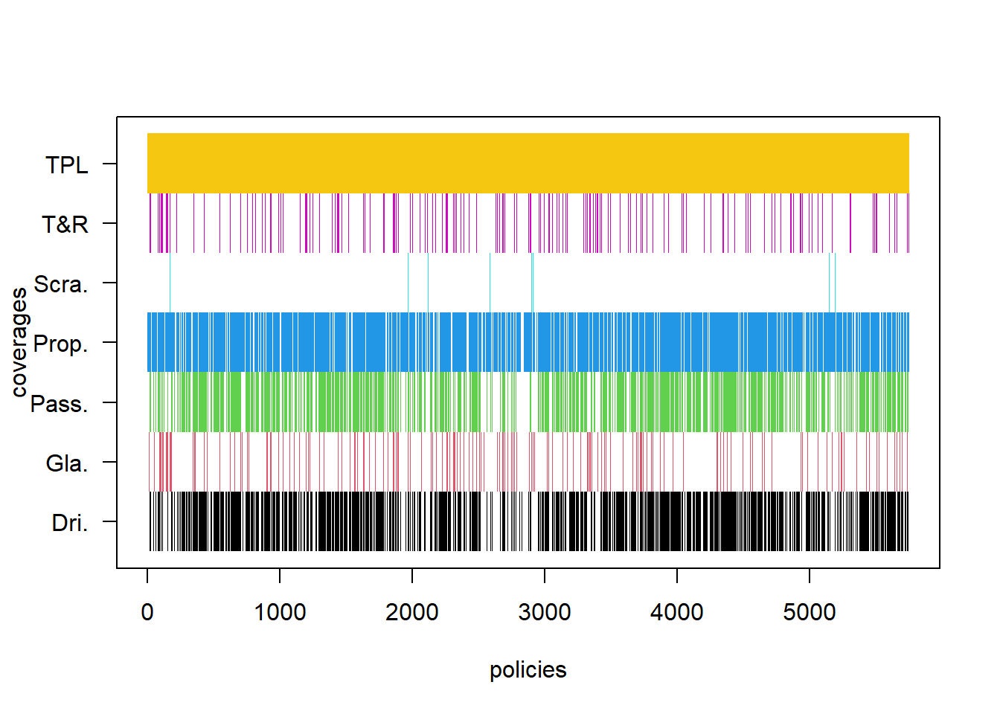
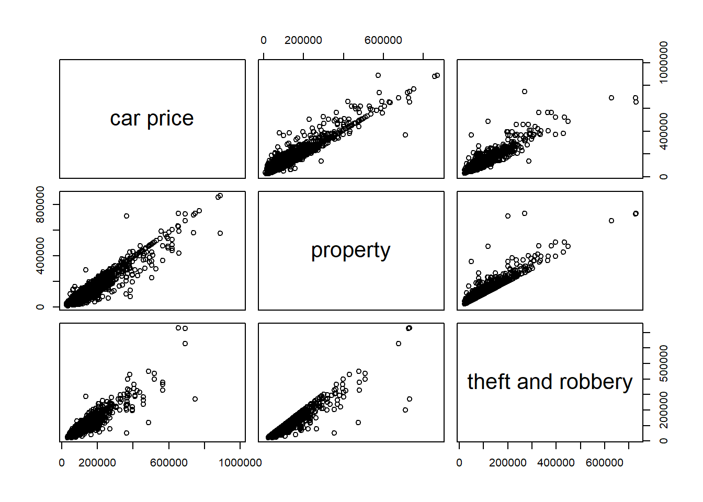
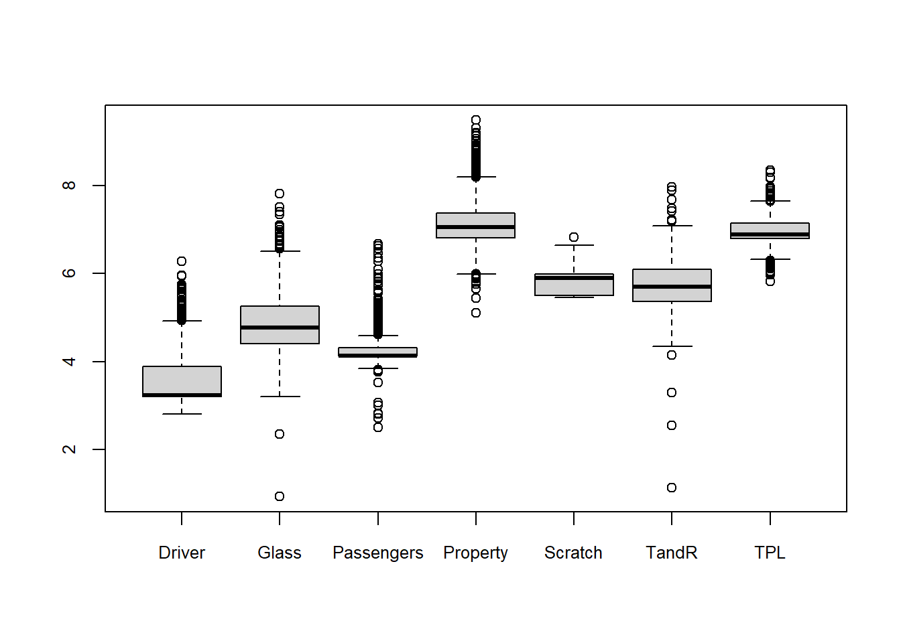

# Commercial policies

In this section we construct the claims frequency data for the commercial policies. We discuss the data cleaning and perform  preliminary summary analysis. 
From Table \@ref(tab:zero-claim), we have seen that the claims frequency for driver, passengers, theft and robbery, glass, and scratch is quite small. It is impossible to set up claims frequency models for those coverages. **We will focus on the claims frequency model of TPL and property coverages. The other coverages will be treated as policy attributes.**

We remove the 61 coverages with non-positive premiums. There are 20498 coverages of 6005 commercial policies on 2294 cars. 
We aggregate the coverages with respect to policies, i.e., each row of the original data is *one coverage of a policy* and each row of the new data is *a policy*.
In a commercial policy, people can choose any coverages from the 7 coverages: TPL, property, driver, passengers, theft and robbery, glass, and scratch.

## Data cleaning

The commerical policy data has the similar variables to the CTPL data such as `Device_ID`, `Policy_Code`, `KINDSTARTDATE`, `DUEENDATE`, `UNDERWRITTENDATE`, `YEARS`, `PURCHASEPRICENOTAX`, `SEATCOUNT`, `CARBRAND`, `CARSERIESNAME`, `USEYEARS`, `BRANCHNAME`, `AGE`, `SEX`, `LASTCLAIMCOUNT`, `NCD_Compulsory` (changed to `NCD_Commercial`), `RISKCODE`, `PREMIUM_Total`. The variables `KINDCODE`, `AMOUNTNEW`, `FLAG`, `PREMIUM`, `Claim_Count` need to split into 7 components corresponding to the 7 coverages. We discuss the data cleaning as following.

We correct for 3 age errors, 2 missing ages, 2 missing gender and 1 AOI error of passenger coverage. The no-claim discount factor for commercial policies takes value from \{0.5, 0.6, 0.7, 0.8, 0.85, 0.9, 1, 1.1, 1.2, 1.25, 1.3, 1.5\}. The relationship between `NCD_Commerical` and `LASTCLAIMCOUNT` is shown in Figure \@ref(fig:ncd-com).

(\#fig:ncd-com)Last claim count v.s. NCD.

We investigate the policies with zero AOI for coverages property, driver, passenger, scratch and find that all of them (except for one) have less than one year exposure. Therefore we remove the 114 policies with less than one year exposure. 
There is a policy missing the AOIs of property damage and theft and robbery. 
This policy made the only one theft and robbery claim of the whole portfolio, and the claim amount is even bigger than the car purchase price. We remove this policy.

We remove 6 policies with more than one year exposure, and remove 2 policies without the TPL coverages.
We now finish the data cleaning for the commercial policies and all the commercial policies have one year exposure. 

We set the observed exposed period as from 2014-01-01 to 2017-06-25. So there are 134 policies outside the observed exposed period and 1552 policies are partially exposed. The claims frequency data of commercial policies is saved as **`policy_commercial.csv`**.

## Comparison of the 7 coverages

The distribution of coverages across the policies is shown in Figure \@ref(fig:cov-dis). All policies contain the TPL coverage and 846 (0.15) policies do not have property coverages.  Very few policies contain theft and robbery, glass damage and scratch coverages.

(\#fig:cov-dis)The distribution of coverages across the policies.

We compare the 7 coverages in terms of **policy numbers, exposure, claim frequency, and non-deductible** in Table \@ref(tab:7-coverages). 
The claims frequency of each coverage is calculated on the policies containing the corresponding coverage. 
The claims frequency for scratch is the highest followed by the property damage. 
Almost all the policies choose non-deductible for TPL, property, driver and passengers. Around 40% policies choose deductible for theft and robbery and scratch. There is no deductible information for glass damage.

Table: (\#tab:7-coverages)Comparison of 7 coverages.

|coverages  | pol_no.|  pol_%| exposures| claims| frequency| Non_ded.|
|:----------|-------:|------:|---------:|------:|---------:|--------:|
|TPL        |    5748| 100.00|      5131|   1033|     20.13|    99.53|
|Property   |    4902|  85.28|      4410|   1752|     39.73|    99.49|
|Driver     |    3707|  64.49|      3354|      2|      0.06|    99.33|
|Passengers |    3526|  61.34|      3191|      1|      0.03|    99.49|
|TandR      |     916|  15.94|       845|      0|      0.00|    37.12|
|Glass      |     891|  15.50|       824|     34|      4.13|     0.00|
|Scratch    |      52|   0.90|        49|     21|     42.61|    42.31|

The amount of insurance (AOI) for TPL, driver, passengers and scratch is fixed to certain levels: 

- TPL \{50000, 100000, 150000, 200000, 300000, 400000, 500000, 1000000, 1500000, 2000000\}

- driver \{10000, 20000, 30000, 50000, 60000, 100000\}

- passenger \{10000, 20000, 30000, 40000, 50000, 60000, 70000, 80000, 120000, 140000, 180000, 200000, 300000, 400000\}

- scratch \{2000, 5000\}.

The AOIs of property and theft and robbery have a linear positive relationship with the purchase price as shown in Figure \@ref(fig:aoi-pur)

(\#fig:aoi-pur)Pair plots of car price, aoi of property, and aoi of theft and robbery.

We show the logarithm of premiums for each coverage in Figure \@ref(fig:com-prem). The TPL and property are the most popular coverages. Though they are expensive most people buy the two coverages. 
The driver and passengers are not very useful (very low frequency) but cheap. So a few people also buy them. The theft and robbery, glass and scratch are more expensive than driver and passengers, so most people do not buy them.

**In the claims frequency analysis we may just study the claims frequency of TPL and property and treat the other coverages as  risk factors.**

(\#fig:com-prem)The distribution of the logrithm of premium for each coverage.

