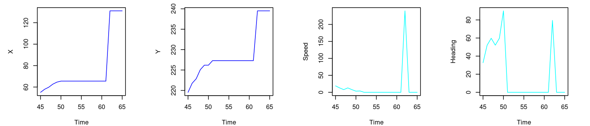
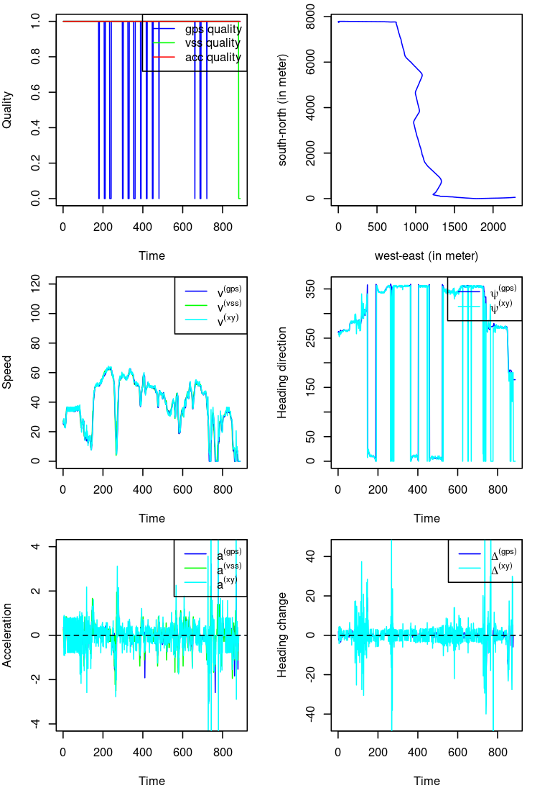
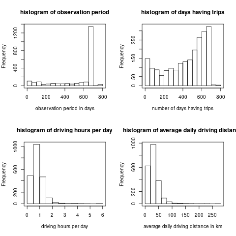

# Telematics car driving data 

*Guangyuan Gao, Yanlin Shi, He Wang*

In this chapter, we first describe the telematics variables collected. 
Then we conduct the data cleaning. 
Finally we get three formats of telematics data: (1) time series; (2) summary statistics; (3) heatmaps.

## Telematics variables

A trip is defined as the period from the engine start to the engine switch off. During a trip, the following 15 variables are recorded second by second. We explain them as follows.

### Field mask

1. `Field_Mask`. This is a hex code which can be converted into a binary vector indicating the validation of the telematics variable 6. `GPS_Latitude` to 15. `Accel_Vertical` (using function `BMS::hex2bin`). Note that the original data records the invalid data as zero, and we need to change those invalid data as `NA`.

### Vehicle identification variables

2. `Device_ID`. This variable also appears in the userlist dataset. It is used to match the telematics data with the policy data.

3. `Detected_VIN`. Given the `Device_ID`, this variable is not very useful in the current study.

### Time

4. `Trip_Number`. This variable is the beginning time of a trip in the UTC format. This variable has the same value during the whole trip. It can be converted to the Beijing time by `as.POSIXlt(,origin="1970-01-01",tz="Asia/Shanghai")`.

5. `Time_Stamp`. This variable is the UTC time of the corresponding record in a trip. This variable is increasing by one in a trip file.

### GPS variables

When the following GPS variables are invalid, they are recorded as zero. To avoid confusion, we change the invalid zero values to `NA`.

6. `GPS_Latitude`. This variable is the GPS latitude in decimal degree multiplied by $10^7$.  

7. `GPS_Longitude`. This variable is the GPS longitude in decimal degree multiplied by $10^6$. 

The GPS spherical coordinates can be converted to the geodetic coordinates $(x,y)$ using `SoDA::geoXY`. The geodetic coordinates can be used to calculate the distance, speed $v^{(xy)}$, angle $\psi^{(xy)}$, acceleration $a^{(xy)}$ and angle change $\Delta^{(xy)}$. There are GPS signal drift problems with the GPS coordinates $(x,y)$, which will affect those derived variables.

8. `GPS_Heading`. This variable  is the approaching direction of the vehicle $\psi^{(gps)}$ in decimal degree  multiplied by $10^2$. It ranges from 0 to 360.

9. `GPS_Speed`. This variable is the vehicle speed $v^{(gps)}$ in $km/h$ multiplied by $10$. Note that $3.6 km/h = 1 m/s$.

10. `Positional_Quality`. This variable indicates the GPS signal quality. When it is zero, the vehicle cannot be located by the GPS satellite and the above four variables are invalid. Sometimes when it is one, the GPS coordinates might be zero. **So it is better to judge the GPS validation using both the GPS coordinates and this variable**.

### Instrument panel variables

11. `VSS_Speed`. This is the vehicle speed $v^{(vss)}$ shown in the instrument panel. The insurer told us that when this variable is valid it is more reliable than the `GPS_Speed` $v^{(gps)}$. 

12. `Engine_RPM`. This is the rotation of engine per minute shown in the instrument panel. We do not use this variable in the study.

### Accelerometer variables

The following three variables are measured by a three-axis accelerometer.

13. `Accel_Lateral`. The lateral acceleration $a'^{(acc)}$ is perpendicular to the car approaching direction, which measures the change of car approaching direction.

14. `Accel_Longitudinal`. The longitudinal acceleration $a^{(acc)}$ is along the car approaching direction, which measures the change of speed values.

15. `Accel_Vertical`. The vertical acceleration is always around the gravity $9.8$m/s$^2$.

There is calibration bias with these variables as we will see later. And it is difficult to deal with this issue.
**Therefore, we will use the derived longitudinal acceleration rates  $a^{(gps)}, a^{(vss)}, a^{(xy)}$ which are obtained from the GPS speed $v^{(gps)}$, the VSS speed $v^{(vss)}$, and the GPS coordinates $(x,y)$, respectively. And we will replace the lateral acceleration by the angle changes of heading $\Delta^{(gps)},\Delta^{(xy)}$, which are obtained from the GPS heading $\psi^{(gps)}$ and the GPS coordinates $(x,y)$, respectively.**

## Telematics data cleaning

Telematics car driving data is a big data. 
Data cleaning for big data is very challenging since we need to apply the same cleaning procedure to all the trips of all cars. 
The data cleaning should be flexible enough in order to be applied to all trips. 
On the other hand, according to the large number theorem, if there were no systematic data error, we could get reliable results using summary statistics of telematics variables even though we did not perform a perfect data cleaning.

We first visualize several trips to find what data issues need to be addressed during the data cleaning. Then we design a "naive" data cleaning procedure. We modify the data cleaning procedure by monitoring its performance on selected trips. Finally we get a "universally" applied data cleaning procedure.

### Original telematics data

We first look at three trips of three drivers in the following Figures. For each trip, we draw the following 6 plots: 

1. Top-left: The time series of GPS signal quality, instrument  panel signal quality, and accelerometer signal quality; 
2. Topright: The trajectory $(x,y)$; 
3. Middle-left: The time series of GPS speed $v^{(gps)}$, VSS speed $v^{(vss)}$, 
4. Middle-right: The time series of GPS heading $\psi^{(gps)}$; 
5. Bottom-left: The time series of longitudinal acceleration $a^{(acc)}$;
6. Bottom-right: The time series of lateral acceleration $a'^{(acc)}$.

(\#fig:fig1-1)One trip of driver  8

Figure \@ref(fig:fig1-1) shows a very short trip of 2 minutes for driver 8. 

- The top-left plot shows that the vss signal is missing in the last 40 seconds. 
- The top-right and middle-right plots show that the vehicle starts from east-south and approaches to west-north. Note that there are jumps between $\psi^{(gps)}=0$ and $\psi^{(gps)}=360$. 
- The middle-left plot shows that the GPS speeds match with the VSS speeds and the VSS speeds are missed for the last 40 seconds. 

- The bottom two plots show that there are **calibration bias** with both the acceleration rates. We might correct for the bias by subtracting the median of acceleration rates.

(\#fig:fig1-2)Two trips of driver  8

Figure \@ref(fig:fig1-2) shows another two trips of driver 8. 

- For the left trip, the bottom two plots indicate the calibration bias of accelerometer again. 

- For the right trip, there are several parts missing the GPS signal. We need to interpolate the GPS coordinates, the GPS speed and heading when the GPS signal is missing.

(\#fig:fig2)Three trips of driver  288

Figure \@ref(fig:fig2) shows three trips of driver 288. The GPS signals seem stable for the three trips, and the accelerometer seems work well except for the lateral acceleration of the second trip. 

(\#fig:fig3)Three trips of driver  1188

Figure \@ref(fig:fig3) shows three trips of driver 1188. The GPS signals are unstable in the first two trips, and the VSS signals are unstable for the last two trips. There seems calibration bias of the acceleration rates for all these trips.

In a **summary**, we need to do the following data cleaning:

- There are missing values in GPS coordinates $(x,y)$, GPS speed $v^{(gps)}$, GPS heading $\psi^{(gps)}$, and VSS speed $v^{(vss)}$. **We need to interpolate these missing values.** 

- There are frequent calibration problems with the accelerometer variables $a^{(acc)},a'^{(acc)}$. It is difficult to remove the calibration bias since the incurring time and the severity of calibration bias are rather random. **We'd better use other variables to describe the acceleration in the two directions.**

### Data imputation

Data imputation is necessary if we analyze the time series of telematics variables.
However, if we are only interested in summary statistics of telematics variables such as mean of speed, standard deviation of acceleration, we do not need to interpolate the missing values according to the law of large number.

We linearly interpolate the missing values of GPS coordinates $(x,y)$, GPS speed $v^{(gps)}$, GPS heading $\psi^{(gps)}$, and VSS speed $v^{(vss)}$, respectively. Note that when the missing values incur at the boundaries of a trip, we cannot interpolate them. 

<!-- The imputation model is a generalized additive model using the B-spline basis of time in degree one placing knots in every valid value. -->
<!-- Note that model fitting may take a long time if the trip duration is long.  -->

Remarks: The imputation of GPS heading around 0 or 360 degree is difficult. However, in our study we are more interested in the angle change and we take sin of the angle change. Those calculations reduce the effects of wrong GPS heading imputation. GPS drifts may affect GPS speed, angle change and acceleration. However, GPS drifts does not happen frequently.

### Derived acceleration and angle change

Since the quality of accelerometer variables are poor, we need to find other variables to measure the acceleration and direction changes. 

We calculate the acceleration rate by using GPS speed $v^{(gps)}$, VSS speed $v^{(vss)}$ or GPS coordinates $(x,y)$:
\begin{equation} 
\begin{aligned} 
a^{(gps)}_t&=v^{(gps)}_{t}-v^{(gps)}_{t-1} \\ 
a^{(vss)}_t&=v^{(vss)}_{t}-v^{(vss)}_{t-1} \\
a^{(xy)}_t&=v^{(xy)}_{t}-v^{(xy)}_{t-1}
\end{aligned}
\end{equation}
where $$v^{(xy)}_t=\sqrt{(x_t-x_{t-1})^2+(y_t-y_{t-1})^2}.$$

We measure the direction change by the angle change which can be calculated using either GPS heading $\psi^{(gps)}$ or GPS coordinates $(x,y)$:
\begin{equation} 
\begin{aligned} 
\Delta^{(gps)}_t&=\arcsin\left( \sin\left(\psi^{(gps)}_{t}-\psi^{(gps)}_{t-1}\right)\right) \\ 
\Delta^{(xy)}_t&=\arcsin\left(\sin\left(\psi^{(xy)}_{t}-\psi^{(xy)}_{t-1}\right)\right)
\end{aligned}
\end{equation}
where 
$$\psi^{(xy)}_t=\mathbb{1}_{(-\infty,0)}\left(\arctan2\left(\frac{x_t-x_{t-1}}{y_t-y_{t-1}}\right)\right)\times2\pi+\arctan2\left(\frac{x_t-x_{t-1}}{y_t-y_{t-1}}\right)\in[0,2\pi].$$
Note that a positive value of $\Delta$ indicates a right turn while the negative one indicates a left turn. The jump between 0 and 360 is not an issue since we take sin. 

Remarks: Be careful when converting speed units from km/h to m/s, and angle units from decimal degree to radian. The original GPS coordinates is spherical coordinates and they need to be converted to the geodetic coordinates before doing the above calculation.

### Selection of telematics variables

We discuss the selection among the telematics variables: speed  $v^{(gps)},v^{(vss)},v^{(xy)}$, acceleration $a^{(gps)},a^{(vss)},a^{(xy)}$, angle $\psi^{(gps)},\psi^{(xy)}$, and angle change $\Delta^{(gps)},\Delta^{(xy)}$.
After data imputation and deriving the corresponding telematics variables, we draw the same trips as those in Figures \@ref(fig:fig1-1),\@ref(fig:fig1-2), \@ref(fig:fig2) and \@ref(fig:fig3).

(\#fig:fig1-1-p)One trip of driver  8

- The top two plots in Figure \@ref(fig:fig1-1-p) are exactly the same as the top two in Figure \@ref(fig:fig1-1). 

- In the middle-left plot, we add $v^{(xy)}$ for comparison. Note that there is a GPS drift around 60 second causing a jump of $v^{(xy)}$. 

- In the middle-right plot, we add $\psi^{(xy)}$ for comparison. The derived heading direction $\psi^{(xy)}$ is always zero when the vehicle stands still after 50 seconds. 

- In the bottom plots we show the derived acceleration $a^{(gps)},a^{(vss)},a^{(xy)}$ and the derived angle change $\Delta^{(gps)},\Delta^{(xy)}$. 

(\#fig:gps-drift)GPS drift

We investigate the GPS drift around 60 seconds. In Figure \@ref(fig:gps-drift), we draw the time series of $(x,y)$ coordinates, $v^{(xy)}$ and $\psi^{(xy)}$ from 45 second to 65 second, respectively. 
We see a jump of $(x,y)$ at 62 second which leads to an extremely speed jump from 0 to more than 200 km/h and an extremely direction jump from 0 to more than 60 degree in a second. 

**We conclude that the derived variables from GPS coordinates are unstable compared with the derived variables from GPS speed, GPS heading and VSS speed.  This is due to the measurement error of GPS coordinates and its leverage effects on the acceleration and angle change.**

(\#fig:fig1-2-p)Two trips of driver  8

- For the second trip of driver 8, we see a GPS drift around 70 second. 

- For the third trip of driver 8, the imputation works very well for GPS coordinates, GPS speed and GPS heading. GPS drifts are often observed when there is a speed peak. The heading $\psi^{(xy)}$ derived from GPS coordinates is always incorrectly zero when the vehicle stops. Again, the acceleration and angle change derived from GPS coordinates are very unstable.

(\#fig:fig2-p)Three trips of driver  288

(\#fig:fig3-p)Three trips of driver  1188

There are no new observations in Figures \@ref(fig:fig2-p) and \@ref(fig:fig3-p). 

**In a summary, we conclude that**

- The linearly imputation works well.

- Due to the GPS coordinates drift, we should avoid to use the variables derived from $(x,y)$. Instead, the telematics variable $v^{(vss)}, v^{(gps)}, a^{(vss)}, a^{(gps)}, \psi^{(gps)}, \Delta^{(gps)}$ are reliable.

- The distance should be derived using the speed variable rather than the coordinates.

- The three variables $v,a,\Delta$ are related to driving behavior, while the direction $\psi^{(gps)}$ is not relevant.

- We should use the variables from the same sensor in a certain study, i.e., either $(v^{(vss)},a^{(vss)})$ or $(v^{(gps)},a^{(gps)},\Delta^{(gps)})$.

### Saved telematics variables

To save the disk space, for each trip we extract the following telematics variables.

1. GPS speed $v^{(gps)}$

2. GPS heading $\psi^{(gps)}$

3. Validation of GPS

4. VSS speed $v^{(vss)}$

5. Validation of VSS

Note that we can derive the acceleration and angle change easily from the speed and heading. Note that if the GPS is invalid, the corresponding variables are recorded as NA. So does the VSS.

We name the trip file as `Device_ID_Trip_Number.csv`, so the `Device_ID` and the trip beginning time `Trip_Number` are saved in the file name.
We save the preprocessed "thin" trips into **`./telematics_data/compulsory_cleaned/Device_ID/Policy_Code/Device_ID_Trip_Number.csv`**. 

We draw the speed $v^{(gps)}$, heading direction $\psi^{(gps)}$, acceleration $a^{(gps)}$, angle change $\Delta^{(gps)}$ for the previous trips. 
We denote the times for missing values by a horizontal line at the top of each plot. Note that we have capped the $a^{(gps)}$ between $(-4,4)$m/s$^2$, and $\Delta^{(gps)}$ between $(-45^{\circ},45^{\circ})$.

(\#fig:fig1-gps)Three trips of driver  8

(\#fig:fig2-gps)Three trips of driver  288

(\#fig:fig3-gps)Three trips of driver  1188

Finally, we interpolate the missing $v^{(gps)}$ and $\psi^{(gps)}$ linearly. We calculate $a^{(gps)}$ and $\Delta^{(gps)}$ from the imputed values. The corresponding figures are shown as follows.  

(\#fig:fig1-gps-p)Three trips of driver  8

(\#fig:fig2-gps-p)Three trips of driver  288

(\#fig:fig3-gps-p)Three trips of driver  1188

## Three formats of telematics data

We consider three formats of telematics data. The first format is **time series**. The second format is  **summary statistics**. The third format is  **heatmap**. 

The data imputation is important for the first format, while the imputation is not so important for the second and the third format. Hence, to get the second and third formats, several steps above can be skipped, i.e., we select the valid GPS variables and discard the invalid GPS variables and we do not need to perform the data imputation. 

No matter which format is used, we must consider the speed interval and cap the acceleration and angle change. A particular speed interval makes the comparison among drivers more sensible, and truncation eliminates the leverage effects of outliers. The activation functions in the neural networks play the similar role. 

### Time series of individual trips

An observation from Figure \@ref(fig:fig1-1) is that a trip may contain several standing still phases $\{t: v_t=0,a_t=0\}$. 
Those phases should be removed since they have nothing about the driving behavior. Also note that when the car speed is slow, the GPS tends to be more unreliable and the angle change tends to be large, e.g., parking.
Suppose we consider the driving behavior in the speed interval $[10,60]$ km/h. By focusing on a particular speed bucket, we can make more sensible comparison among drivers. 

We first extract partial trips in $[8, 62]$ km/h, and then set the acceleration and angle change in the shifting parts $[8,10] \cup [60,62]$ km/h as zero. Finally, we set the speed as $10$ and $60$ km/h in the shifting parts $[8,10] \cup [60,62]$ km/h, respectively.

We save the first $\tau=5\times60$ seconds of such concatenated trips for each trip. Note that for the trips considered above, we obtain the following three concatenated trips in Figure \@ref(fig:trip-concatenated). The other trips do not spend at least 5 minutes in speed interval $[10,60]$ km/h.  

(\#fig:trip-concatenated)The third trip of driver 288. The first and second trips of driver 1188.

We extract at most 500 trips for each car in the folder **`./telematics_data/compulsory_concatenated/Device_ID/Device_ID_Trip_Nubmer.csv`**. 
Therefore, for each driver $i=1,\ldots,n$, we have $c_i\in[0,500]$ pre-processed trips. The distribution of $c_i\in(0,500)$ is shown in Figure \@ref(fig:concatenated-summary). 
Note that there are 175 cars (8%) without pre-processed trips and there are 1721 cars (75%)  cars with 500 pre-processed trips. 

For driver $i$ with $c_i>0$ trips, we stack its trips into a $c_i\times300\times3$ array $\mathbb{z}_i=(z_{i,1},\ldots,z_{i,c_i})'$, where each trip $z_{i,j}\in[10,60]^{300}\times[-4,4]^{300}\times[-45^{\circ},45^{\circ}]^{300}$. 
Note that we will use the un-bolded notation $z_j$ to refer to a trip $j$ without considering which driver it belongs to. 

(\#fig:concatenated-summary)The distribution of pre-processed trips in (0, 500)

### Summary statistics of telematics variables

We extract several summary statistics for each trip. We categorize those summary statistics into two types: **exposure** and **driving style**. We define two status of driving: **idle phrase and moving phrase**. In the idle phrase, the speed, acceleration and angle change are simultaneously equal to zero. In the moving phrase, at least one of the speed, acceleration and angle change is not equal to zero. Note that we receive for $2296-165=2131$ cars since $165$ cars do not have telematics information. We save them in the folder **`./telematics_data/compulsory_statistics/Device_ID.csv`**.

#### Exposures

1. Total distance in km (1 variable).

2. Total moving time in second (1 variable).

3. Total standing time in second (1 variable).

4. The day of the trip from Monday to Sunday (1 variable).

5. Driving distance split into morning peak (7-9), day (9-17), afternoon peak (17-19), evening (19-22), and night (22-7) (5 variables).

6. Driving time (moving time) split into morning peak (7-9), day (9-17), afternoon peak (17-19), evening (19-22), and night (22-7) (5 variables).

In Figure \@ref(fig:exposure-summary) we show the distribution of observation period, days having trips, driving hours per day and average daily driving distance.

(\#fig:exposure-summary)The distribution of telematics exposure

#### Driving styles

1. Average/median/standard deviation/extreme values (5% and 95% quantiles) of speed/acceleration/angle change during the driving phrase (15 variables).

2. Driving time (moving time) split into  in the speed interval 0-10/10-20/20-30/.../110-120/>120 (13 variables).

3. Driving time (moving time) split into the acceleration intervals (-4)-(-3.5)/(-3.5)-(-2.5)/.../2.5-3.5/3.5-4 (9 variables).

4. Driving time (moving time) split into the angle change intervals (-45)-(-35)/(-35)-(-25)/.../25-35/35-45 (9 variables).

### Heatmaps

Heatmaps reflect the interaction among speed, acceleration, and angle change. For each car, we construct three heatmaps: **speed-acceleration heatmap, speed-angle heatmap, and acceleration-angle heatmap**. We use the telematics data in the moving phrase to construct the heatmap. The heatmaps are saved in **`./telematics_data/compulsory_speed_accel_angle/Device_ID_accel_angle.csv (Device_ID_speed_accel.csv, Device_ID_speed_angle.csv)`**. 

The speed interval is divided into sub-intervals at 0, 10, 20, 30, 40, 50, 60, 70, 80, 90, 100, 110, 120, 200.  The acceleration is divided into sub-intervals at -4, -3.5, -2.5, -1.5, -0.5, 0.5, 1.5, 2.5, 3.5, 4. The angle change is divided into sub-intervals at -45, -35, -25, -15, -5, 5, 15, 25, 35, 45.  
We typically truncate the speed interval and cap the acceleration and angle change interval. 
We need to make sure the considered intervals contain sufficient observations to receive stable heatmaps. Usually, we need to normalize the heatmap. We could do the normalization in each speed sub-interval or in several consecutive speed sub-intervals.

