<!-- # (PART) MODELLING {-} -->

# Claims frequency modeling


We consider the claims history of 1847 cars whose exposure is ranging from 1 to 3.48. 
Those cars have more than 100 and at most 500 concatenated trips of 5 minutes (see the previous section).
Note that 1598 drivers have 500 telematics trips.
We show the distribution of claims number and exposures in Figure \@ref(fig:claims-plot). We observe that most drivers do not have a claim. The total claims number is 933 and the total exposures is 4215. The empirical claims frequency is 22.14\% per driver per year.

<div class="figure" style="text-align: center">
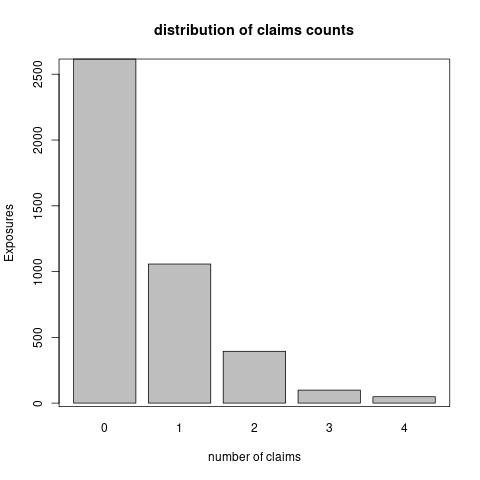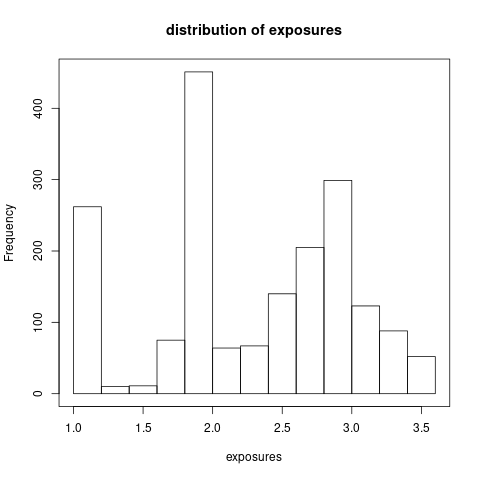
<p class="caption">(\#fig:claims-plot)The distributrion of claims number and exposures</p>
</div>

**Remark**: Our preliminary data cleaning ensures that the main driver of a car does not change over the entire observation period and we concatenate policy renewals of the same driver over this observation period.
Thus, we can follow the same driver for at most 3 years and 5 months from 01/01/2014 to 31/05/2017.

**Remark**: We follow insurance policies over multiple years, but only for the most recent periods there is telematics data available. For this reason, we typically have a longer observation period of claims history on insurance policies than of corresponding telematics data.
An implicit assumption is that the driving habits and styles in the most recent periods are good representations for the entire observation period of insurance exposure.

## Data preprocess

We have discussed the telematics car driving data in the previous section. 
Here we provide a summary description of the available actuarial risk factors and partition the portfolio to facilitate the out-of-sample prediction.

### Variable preprocess 

The available actuarial risk factors are `regions, driver's age, driver's gender, car brand, car's age, seat count and car's price`. We preprocess them as follows:

-  `regions`: There are three main regions, Hebei Province, Zhejiang Province and Shanghai, which have accounted to 97.67% of total cars. 
Hence, we merge the regions not in the three main regions. The distribution of exposures in those four regions is shown in Figure \@ref(fig:region-plot). 

Note that one may create a continuous variable of population density of each region. The population density should be a factor affecting the claims frequency, since it is related to the traffic density. 

<div class="figure" style="text-align: center">
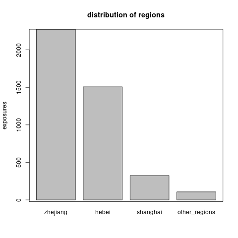
<p class="caption">(\#fig:region-plot)The distribution of exposures across the regions.</p>
</div>


- `driver's age`: We discretize driver's age into five groups using a marginal Poisson  regression tree model. 
The cut-off values of age are 29, 33, 35, 45. 
Note that we try to obtain a finer grouping of age and merge age groups during the variable selection. 
Figure \@ref(fig:age-plot) shows the (marginal) Poisson tree and the distribution of exposures across the age groups. 

   |age group|age interval|
   |:---:|:---:|
   |young|$[18,29)$|
   |middle1|$[29,33)$|
   |middle2|$[33,35)$|
   |mature1|$[35,45)$|
   |mature2|$[45,100)$|

<div class="figure" style="text-align: center">
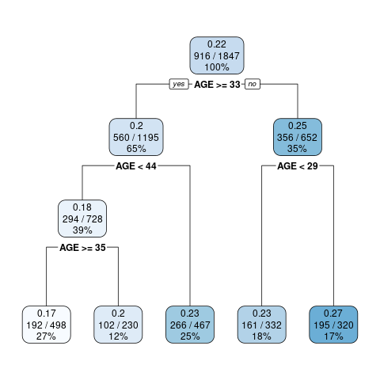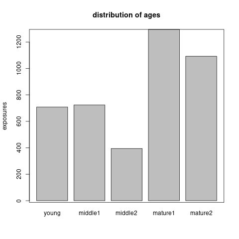
<p class="caption">(\#fig:age-plot)The marginal Poisson tree and the distribution of exposures across the age groups.</p>
</div>

- `gender`: Male drivers are almost as double as female ones as shown in Figure \@ref(fig:gender-plot).

<div class="figure" style="text-align: center">
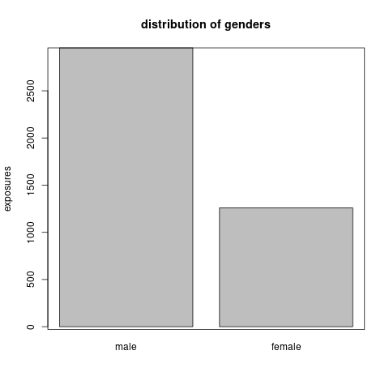
<p class="caption">(\#fig:gender-plot)The distribution of exposures across the gender</p>
</div>

- `car brand`: There are 66 different car brands. 
However, most car brands contain very few cars. We aggregate the car brand according to its made country. 
Thus we group the cars into made in Germany, Japan, China, US, Korean and Europe (except of Germany). 
Figure \@ref(fig:car-plot) shows the distribution of exposures across the car made countries.

<div class="figure" style="text-align: center">
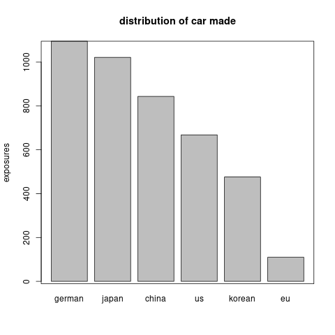
<p class="caption">(\#fig:car-plot)The distribution of exposure across car made countries.</p>
</div>

- `car's age`: For the car's age, we show its distribution in Figure \@ref(fig:car-age-plot). 
<!-- There are few cars used for more than useyear_cap years. -->
<!-- Thus we create a new variable `capped car's age` which caps car's age by useyear_cap. -->
A preliminary analysis shows that the claims frequency is related with car's age log-linearly. So we do not need to discretize it.

<div class="figure" style="text-align: center">
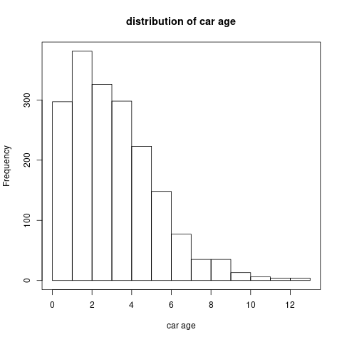
<p class="caption">(\#fig:car-age-plot)The histogram of car's age</p>
</div>

- `seat count`: Around 95.67% cars have 5 seats as shown in Figure \@ref(fig:seat-plot). So this variable is not quite useful for claims frequency prediction.

<div class="figure" style="text-align: center">
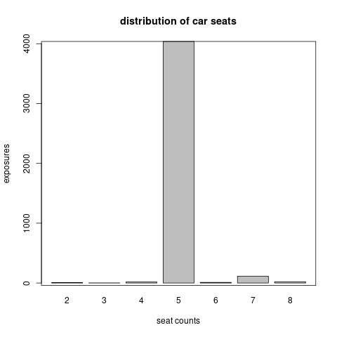
<p class="caption">(\#fig:seat-plot)The distribution of exposure across seat count.</p>
</div>

- `car's price`: We take the logarithm of car's price. The distribution of the car's price in logarithm is shown in Figure \@ref(fig:car-price-plot). 
A preliminary analysis (using tree, GAM, and GLM) shows that this variable doesn't have a close relationship with claims frequency (marginally). 

<div class="figure" style="text-align: center">
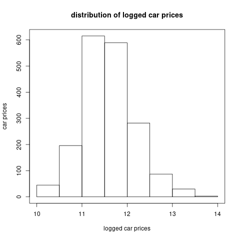
<p class="caption">(\#fig:car-price-plot)The histogram of car's price</p>
</div>

- `average daily distance`: We fit a (marginal) generalized additive model to investigate the non-linear effect of average daily distance on claims frequency. 
The left plot in Figure \@ref(fig:daily-D) shows that we most of the logged daily distance are between 2.5 and 4.5. 
Moreover, if we truncate the logged daily distance at 2.5 and 4.5, we will get a linear effect of logged daily distance on claims frequency. 
The right plot in Figure \@ref(fig:daily-D) confirms our propose and in the following GLM we will use the truncated logged daily distance. 
Figure \@ref(fig:daily-hist) compares the distributions of the orginal variable and the truncated variable.

<div class="figure" style="text-align: center">
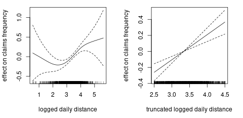
<p class="caption">(\#fig:daily-D)The effect of logged daily distance on claims frequency.</p>
</div>

<div class="figure" style="text-align: center">
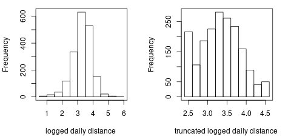
<p class="caption">(\#fig:daily-hist)The distribution of logged daily distance.</p>
</div>

### Data partition


We will compare models in terms of out-of-sample prediction.
Stratified split (w.r.t. claims numbers) is used to partition the data into train, validation, and test data sets ($0.6:0.2:0.2$). The exposures, the claims number, and the claims frequency of each data set are listed in Table \@ref(tab:data-split-info). We denote the index of each data set $\mathcal{D}_\text{train}, \mathcal{D}_\text{validation}, \mathcal{D}_\text{test}$ by $\mathcal{I}_\text{train},\mathcal{I}_\text{validation},\mathcal{I}_\text{test}$ and $\mathcal{I}_\text{learn}=\mathcal{I}_\text{train}\cup\mathcal{I}_\text{validation}$.


Table: (\#tab:data-split-info)Data partitions

|data       | cars| exposure| claims| frequency|
|:----------|----:|--------:|------:|---------:|
|train      | 1104|     2522|    552|    0.2189|
|validation |  372|      843|    192|    0.2279|
|test       |  371|      850|    189|    0.2223|

## Generalized linear model for claim counts

Generally we assume the claims number $N_i$ follows a Poisson distribution with mean of $e_i\lambda(\boldsymbol{x}_i)$
$$N_i~ \overset{ind}{\sim}~ \text{Poi} (e_i\lambda(\boldsymbol{x}_i)),$$

where $e_i$ is the exposure and $\lambda(\boldsymbol{x}_i)$ is the estimated claims frequency per driver per year given the risk factors $\boldsymbol{x}_i\in \mathcal{X}$. The function $\lambda$ is a mapping from the risk factors to the claims frequency:
$$\lambda: \mathcal{X} \rightarrow \mathbb{R}_+, ~~ \boldsymbol{x}\mapsto \lambda(\boldsymbol{x}).$$

We first establish the base line GLM for claim counts with $\lambda$ as a linear function. Then in the next two sections, we improve it by either relaxing the linear  function $\lambda$ or introducing telematics covariates to expand the covariate space $\mathcal{X}$.

### Poisson deviance loss function

It is natural to use the Poisson deviance loss function to compare the prediction performance of different models. The out-of-sample Poisson deviance loss on the data $\mathcal{D}_\text{test}$ is defined as:

$$\mathcal{L}(\hat{\lambda},\mathcal{D}_\text{test})=\frac{2}{|\mathcal{D}_\text{test}|}\sum_{i \in \mathcal{I}_\text{test}}\left(e_i\hat{\lambda}(\boldsymbol{x}_i) - N_i -N_i \ln e_i\hat{\lambda}(\boldsymbol{x}_i) + N_i\ln N_i \right).$$

Normally, the mapping $\hat{\lambda}$ contains the estimated parameters using the training data $\mathcal{D}_\text{train}$ (or the learning data $\mathcal{D}_\text{learn}$ in GLM). 

<!-- Hence, if $\mathcal{D}=\mathcal{D}_\text{train}$ the above defines an in-sample loss of training loss and if  $\mathcal{D}=\mathcal{D}_\text{test}$ the above defines an out-of-sample loss of test loss. We will evaluate the predictive performances of models by comparing test loss.  -->

### Generalizd linear models 

We begin with the golden standard model of generalized linear model. The GLM assumes the following linear mapping: 

\begin{equation}
\begin{aligned}
\ln \lambda^{\text{(GLM)}}(\boldsymbol{x})=&\beta_0+\alpha_\text{region}+\gamma_\text{age_group}+\zeta_\text{female}+  \delta_\text{car_made}+\\
&\beta_1\text{car_age}+\beta_2\text{logged_daily_distance},
\end{aligned}
\end{equation}
where we assume Zhejiang Province, middle age 1, female, Germany made car as the reference levels, and we have discretized the age in order to obtain the log-linear effects. 
Note that we estimate the coefficients using the learning data $\mathcal{D}_\text{learn}$. 

We then perform a step-wise variable selection according to AIC. The final model is selected as follows:

\begin{equation}
\begin{aligned}
\ln \lambda^{\text{(GLM)}}(\boldsymbol{x})=&\beta_0+\alpha_\text{hebei}+\gamma_\text{young}+\gamma_\text{middle1}+\gamma_\text{mature2}+\delta_\text{china}+\delta_\text{eu}+\\
&\beta_1\text{car_age}+\beta_2\text{logged_daily_distance},
\end{aligned}
\end{equation}

Hence, we have merged Shanghai Province and other regions with Zhejiang Province, middle age 2 with mature age 1, and all the car mades with Germany made except China and Europea. 
We have removed the gender and the car's price.
We get the test error as $1.0306$. Note that test error of homogeneous model is $1.1003$.   


## Improved GLM with boosting methods

Next we explore the possibility of improving GLM using either the *generalized boosted regression model* or the *XGBoost*. The mapping $\lambda$ from actuarial risk models to claims frequency is assumed as follows:

$$\ln \lambda(\boldsymbol{x})= \ln {\lambda}^\text{(GLM)}(\boldsymbol{x}) + \ln {\lambda}^\text{(BST)}(\boldsymbol{x}).$$

With the above structure, we can explore the non-linear effects and the interaction effect which are omitted in the GLM. We include the region, driver's age (continuous variable), gender, car made, car's age and (logged) car's price into the boosting model $\lambda^{\text{(BST)}}$. 

### Generalized boosted regression modeling

The R code of generalized boosted regression model is shown as follows:


```r
set.seed(7)
gbm1 <-
  gbm(
    Claim_Count ~  BRANCHNAME +  AGE + AGE_G + SEX +
      Car_Made + USEYEARS + Price_log + 
      Daily_log + Daily_Tlog +  offset(log(Fit_GLM)),
    data = rbind(train_data, valid_data),
    distribution = "poisson",
    shrinkage = 0.001,
    n.trees = 100,
    interaction.depth = 1,
    n.minobsinnode = 100,
    bag.fraction = 0.5,
    train.fraction = nrow(train_data) / nrow(learn_data),
    cv.folds = 0,
    verbose = T
  )
(best.iter <- gbm.perf(gbm1, method = "test"))
gbm1$valid.error[best.iter]
```

The code is self explained. And we add illustrations of important arguments:

- `offset(log(Fit_GLM))` indicates that the GBM starts boosting from the GLM prediction of claims number  $\ln e \hat{\lambda}^{\text{(GLM)}}$. Hence we explore the area which is not explored by the GLM.

- `n.trees` is the number of iterations (trees) we tend to boost. `shrinkage` is the learning step. Normally, these two variables are inversely related. It is suggested that using a small learning and a large amount of iterations will lead to a better out-of-sample performance

- `interaction.depth` is the depth of weak learner of tree. Depth of 1 implies we do not consider the interaction term. This variable needs to be tuned using the validation error.

- `n.minobsinnode` is the minimal observations in a leaf node. 

- `bag.fraction` is the proportion of training data used to grow the trees. Here we choose 1 since we have a small portfolio.

- `train.fraction` indicates that the first proportion of rows are used as the train data and the rest are used as the validation data.


Note that we tune the parameters `shrinkage, interaction.depth` by observing the changes in validation error.
It turns out that `interaction.depth=1` leads to the minimal validation error and `shrinkage` does not affect the results too much. 
From Figure \@ref(fig:gbm-plot), we see there is little improvement by the GBM. 
Car's price and driver's age has the largest two importance index indicating that we may do a better grouping of age. 
However, such pre-processing do not bring a much improve to the GLM.  
The test error is $1.0306$ comparing with $1.0306$ from the GLM.

<div class="figure" style="text-align: center">
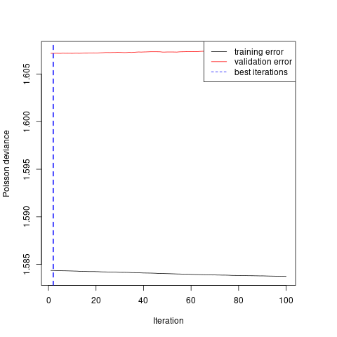
<p class="caption">(\#fig:gbm-plot)Calibration of gradient boosting model</p>
</div>

### XGBoost

Similarly, we can apply the XGBoost to improve the GLM prediction. The R code is given as follows:


```r
set.seed(1)
bst<-
  xgb.train(
    data = dtrain,
    watchlist = list(train = dtrain, test = dvalid),
    objective = "count:poisson",
    nrounds = 1000,
    eta = 0.001,
    max_depth = 2,
    min_child_weight = 100,
    subsample = 1,
    early_stopping_rounds = 5,
    nthread = 4,
    verbose = F
  ) 
bst$best_ntreelimit
bst$best_msg
```


The code is self explained. And we add illustrations of important arguments:

- `nrounds, eta, max_depth, min_child_weight, subsample` play the similar roles as `n.trees, shrinkage, interaction.depth, n.mnobsinnode, bag.fraction` in the GBM.

- `early_stopping_rounds = 5` indicates that if the validation error does not improve  for $5$ iterations the model will stop training.

Again, there is no obvious improvement found by the XGBoost (test error of $1.0308$). 
**We conclude that** the GLM can capture almost all the prediction power of the actuarial risk factors since our pre-processing of variables is appropriate and there is no obvious interaction effects. However, please note that our data only contains 1847 cars so we may not discover the potential non-linear effects and interaction effects based on such a small portfolio.

## Improved GLM with telematics individual trips

In this section, we apply the one dimensional convolutional neural networks (1D CNNs) to evaluate the risk associated with individual trips. 
One dimensional convolutional neural networks can learn the patterns from time series data. 
Another family of recurrent neural network including long short-term memory and gated recurrent unit can also be used to analyze time series data.
Gao and Wuthrich (2019) have studied the usefulness of 1D CNNs for driver identification rather than risk evaluation of individual trips.

Our proposed method include three steps:
First, we calibrate a 1D CNN to classify trips of the selected archetypal drivers as either **potential risky or potential safe**.
Second, we apply the calibrated 1D CNN to evaluate each trip of each driver and we call the sigmoid probability of the output neuron as the risk score of each trip.
Third, we improve the fitted GLM for claims counts with the **average risk score**:
$$\ln \lambda(\boldsymbol{x})=  \ln {\lambda}^\text{(GLM)}(\boldsymbol{x})+  \ln {\lambda}^\text{(TEL)}(\boldsymbol{x}),$$
where the (logged) telematics modification factor 
$$\ln {\lambda}^\text{(TEL)}(\boldsymbol{x})=  \beta_3+\beta_4\text{ave_risk_score}$$

### Selection of archetypal drivers

Our purpose is to improve the GLM claims frequency prediction using the individual trips risk scores. 
Ideally, the 1D CNNs should explain some variations in the residuals from the Poisson GLM. This motivates how we select the archetypal cars and label their trips.


We calculate the deviance residuals of the Poisson GLM as follows:

$$r_i=\text{sign}(N_i-e_i\hat{\lambda}^{\text{GLM}}(\boldsymbol{x}_i)) \sqrt{2e_i\hat{\lambda}^{\text{(GLM)}}(\boldsymbol{x}_i)-2N_i-2N_i \ln (e_i\hat{\lambda}^{\text{(GLM)}})+2N_i\ln N_i}.$$
We draw the histogram of $r_i, i=1.\ldots,n$ in Figure \@ref(fig:hist-r).

<div class="figure" style="text-align: center">
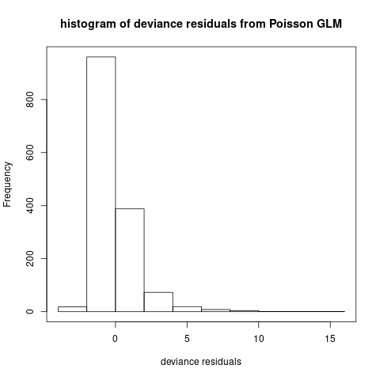
<p class="caption">(\#fig:hist-r)Histogram of deviance residuals</p>
</div>

We select 10 drivers with the largest residuals in the learning data set as archetypal risky drivers, and we label their 5000 trips as potential risky trips (coded as 1).
We show their exposure, claims number, region, age, deviance residuals, and the GLM estimated claims frequency in Table \@ref(tab:ind-high).


Table: (\#tab:ind-high)10 archetypal risky drivers

| Earned_Years| Claim_Count|BRANCHNAME    |  AGE|   Res_D| Freq_GLM|
|------------:|-----------:|:-------------|----:|-------:|--------:|
|       3.1836|           4|other_regions | 33.5|  7.7461|   0.2070|
|       2.9096|           4|hebei         | 28.0|  8.8773|   0.1917|
|       2.0000|           4|zhejiang      | 45.0|  9.0390|   0.2724|
|       2.7918|           3|hebei         | 56.0|  6.7977|   0.1458|
|       2.2055|           4|zhejiang      | 29.0|  7.7946|   0.2966|
|       2.5288|           3|hebei         | 50.0|  8.3549|   0.1200|
|       3.0000|           4|zhejiang      | 34.0| 10.0270|   0.1576|
|       1.0000|           2|shanghai      | 40.0|  5.2395|   0.2218|
|       2.9507|           3|hebei         | 29.0|  5.5946|   0.1748|
|       2.0000|           3|shanghai      | 36.0|  6.4458|   0.2179|

For the archetypal safe drivers, we select 10 drivers with no claim and the largest exposure in the learning data set. We label their 5000 trips as potential safe trips (coded as 0).
We show their information in Table \@ref(tab:ind-low).
Note that we do not select drivers with the smallest residuals. Those drivers are predicted with high claims frequency but without claims.
Those drivers can be potential risky drivers since even the claims frequency is high, the chance of making no claim is still high.
**Our experience show that if we chose drivers with the smallest residuals. We will not calibrate a useful CNN to evaluate the risk of individual trips.**
<!-- Indeed, for the archetypal risky drivers, we could also select those drivers who made the most claims per year. -->
We denote the index set of the archetypal drivers by $\mathcal{I}_{\text{sel}}$.


Table: (\#tab:ind-low)10 archetypal safe drivers

| Earned_Years| Claim_Count|BRANCHNAME |  AGE|   Res_D| Freq_GLM|
|------------:|-----------:|:----------|----:|-------:|--------:|
|       3.4438|           0|hebei      | 32.5| -1.4907|   0.2164|
|       3.4795|           0|hebei      | 39.5| -0.8265|   0.1188|
|       3.4658|           0|zhejiang   | 29.5| -2.1375|   0.3084|
|       3.4466|           0|zhejiang   | 62.0| -1.6836|   0.2442|
|       3.4466|           0|hebei      | 33.5| -0.7848|   0.1139|
|       3.4329|           0|shanghai   | 44.5| -1.5932|   0.2321|
|       3.4438|           0|hebei      | 30.5| -1.2430|   0.1805|
|       3.4795|           0|hebei      | 35.5| -0.7124|   0.1024|
|       3.4274|           0|hebei      | 43.5| -1.2207|   0.1781|
|       3.4603|           0|hebei      | 23.5| -0.9866|   0.1426|

We add two additional telematics variables of squared acceleration rates $a^2$ and squared angle changes $\Delta^2$ to the time series of individual trips.
We denotes the $j$-th trip of driver $i\in\mathcal{I}_\text{sel}$ by $z_{i,j}\in[-1,1]^{300\times 5}$ for $j=1,\ldots,500.$
Note that we have normalized the telematics variables $v, a, \Delta, a^2, \Delta^2$, using the min-max normalization. 

We split the trips of each driver $i$ into training data $(z_{i,j})_{j=1:300}$, the validation data $(z_{i,j})_{j=301:400}$, and the test data $(z_{i,j})_{j=401:500}$.  
One may use the total trips of several risky drivers and safe drivers as as test data. 
**Our experience shows that the neural network cannot be calibrated on this kind partition of data, i.e., the validation error cannot be reduced.**
The reason may be that some safe drivers may have many risky trips and vice versa.


### One dimensional convolutional neural network

We label the trips of the archetypal potential risky drivers as $1$ and those of the archetypal potential safe drivers as 0.
We calibrate a 1D CNN $\phi$ to classify the trips of the selected archetypal drivers:

$$\phi: [-1,1]^{300\times5}\rightarrow (0,1), ~~ z\mapsto\phi(z).$$

We call the sigmoid probability of the output neuron $\phi(z)$ as the risk score of trip $z$. If the output neuron $\phi(z)$ is close to 1, then this trip gets a higher risk score.
The 1D CNN is constructed as follows:
```
Layer (type)                     Output Shape                  Param #     
===========================================================================
trips (InputLayer)               [(None, 300, 5)]              0           
___________________________________________________________________________
cov1 (Conv1D)                    (None, 294, 32)               1152         
___________________________________________________________________________
ave1 (AveragePooling1D)          (None, 58, 32)                0           
___________________________________________________________________________
cov2 (Conv1D)                    (None, 52, 16)                3600        
___________________________________________________________________________
ave2 (GlobalAveragePooling1D)    (None, 16)                    0           
___________________________________________________________________________
dropout (Dropout)                (None, 16)                    0           
___________________________________________________________________________
dense1 (Dense)                   (None, 8)                     136         
___________________________________________________________________________
dropout_1 (Dropout)              (None, 8)                     0           
___________________________________________________________________________
dense2 (Dense)                   (None, 1)                     9           
===========================================================================
Total params: 4,897
Trainable params: 4,897
Non-trainable params: 0
___________________________________________________________________________
```


The calibration is shown in Figures \@ref(fig:cnn-loss) and \@ref(fig:cnn-acc). 
We save the network weights which lead to the lowest validation loss.
The validation accuracy is around $70\%$ and the test accuracy is at the same level. 
We plot the histogram of risk scores for test potential risky trips and for test potential safe trips in Figures \@ref(fig:test_score). The test potential safe trips tend to have a lower risk scores than those riky ones.

<div class="figure" style="text-align: center">
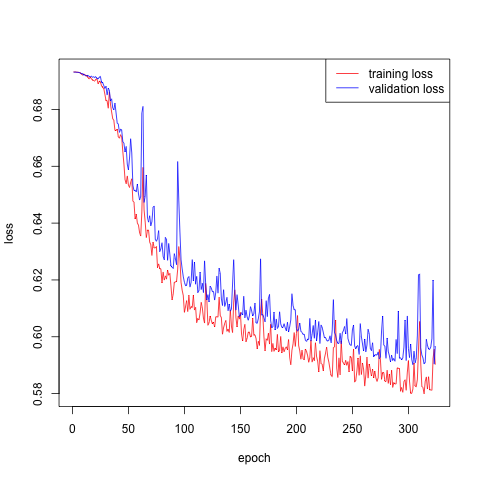
<p class="caption">(\#fig:cnn-loss)Calibration of the CNN</p>
</div>

<div class="figure" style="text-align: center">
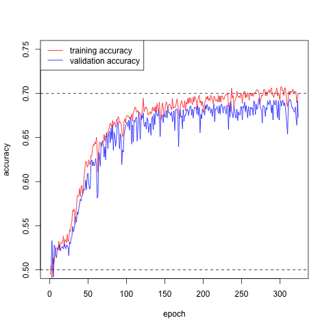
<p class="caption">(\#fig:cnn-acc)Calibration of the CNN</p>
</div>

<div class="figure" style="text-align: center">
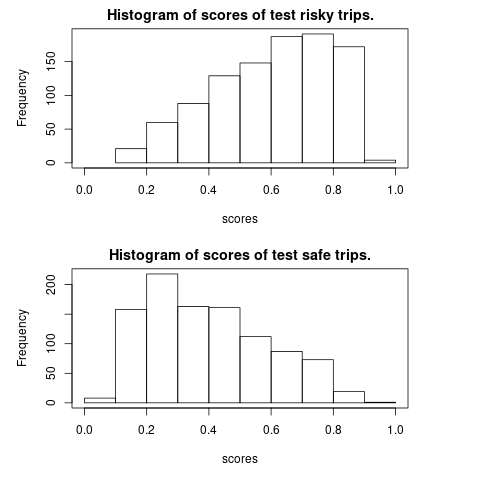
<p class="caption">(\#fig:test-score)Calibration of the CNN</p>
</div>

**Remark**: In the failed trials, we find that the hyperbolic tangent activation is better than the relu activation function and the average pooling is better than the max pooling. 
Including the squared acceleration rates and the squared direction changes would improve the prediction accuracy of 1D CNN.
The disadvantage of 1D CNN is that it is a black box and we do not know how it performs the feature engineering.

### GLM with trips scores


We then use the calibrated CNN to evaluate at most 500 individual trips of each driver. We call the sigmoid probability of the output neuron as the risk score of trips.
We calculate the average risk scores $\text{ave_risk_score}$ for each car.


We investigate the predictive power of risk scores of trips for claims frequency.
We employ the following improved GLM:
\begin{equation}
\ln \lambda(\boldsymbol{x})=  \ln {\lambda}^\text{(GLM)}(\boldsymbol{x})+  \ln {\lambda}^\text{(TEL)}(\boldsymbol{x})=\ln {\lambda}^\text{(GLM)}(\boldsymbol{x})+  \beta_3+\beta_4\text{ave_risk_score}.
\end{equation}
It turns out the test loss is $1.0287$ comparing with $1.0306$ for the GLM.

The estimated telematics modification factor $\lambda^{\text{(TEL)}}$ is
$$\exp(\hat{\beta}_3+\hat{\beta}_4\text{ave_risk_score})=\exp(-0.6878+1.3712\times\text{ave_risk_score})$$
**Our calculated risk scores are in $(0.1511,0.7837)$, so the modfication factor is in $(0.6184,1.4722)$.**
We plot the histogram of **the telematics modification factor** in Figure \@ref(fig:mod-factor).

<div class="figure" style="text-align: center">
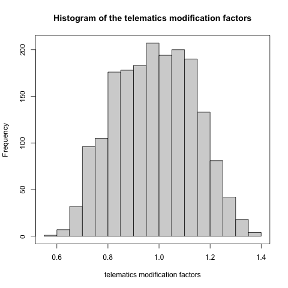
<p class="caption">(\#fig:mod-factor)Histogram of the telematics modification factors</p>
</div>

**Remarks:**
**The key point is to select the archetypal drivers.** 
We try several options and only this works for our data. 
For example, one may wonder to calibrate a CNN on all drivers trips to minimize the Poisson loss. 
This does not work for our data no matter using the individual trips or concatenated trips.
We stress that our portfolio is small which is a limitation of this analysis.

## Discussions

In this section, we discuss the alternatives to the proposed method. **Surprisingly, if we replace the 1D CNN by a logistic regression, we would obtain an equivalent good out-of-sample prediction.**   

### Trips classification by a logistic model

We calculate the mean, median, minimum, maximum, quantile and standard deviation of the speed $v$, acceleration $a$, angle change $\Delta$, squared acceleration $a^2$, and squared angle change $\Delta^2$ for each trip.
Based on those manually engineered features, we implement a logistic regression to classify the trips of the selected archetypal drivers.
The test accuracy is $66.7\%$ while the test accuracy of the CNN is $70.5\%$.
We conclude that although the 1D CNN has a better out-of-sample prediction accuracy, the much simpler logistic regression also capture the major difference between risky trips and safe trips by using summary statistics.
It seems that the chronological property in the telematics data do not play a very important role in the trips classification.


### Competing methods

We consider two competing methods:

1. We calculate the summary statistics for each trip. Then we calculate the average of those summary statistics over all the trips for each driver. Finally, we use those averaged summary statistics as the covariates in the Poisson claims count regression.

2. Following the same procedure as the proposed method, but replacing the 1D CNN by a logistic regression which is discussed in the previous section. 
This competing method uses manually feature engineering while our proposed method uses automatically feature engineering learned by the neural network.


#### Alternative 1: Telematics summary statistics


The test Poisson loss is $1.0379$ which is even worse than the GLM ($1.0306$). However, this approach performs better than the other methods in other two data partitions; see the sensitivity section.

#### Alternative 2: Risk scoring with logistic model


The test Poisson loss is $1.0284$ which is as good as the CNN method ($1.0287$). Figure \@ref(fig:factor-vs) comapre the averaged risk scores from the logistic regression and the 1D CNN. The correlation between them is $0.9181$.

<div class="figure" style="text-align: center">
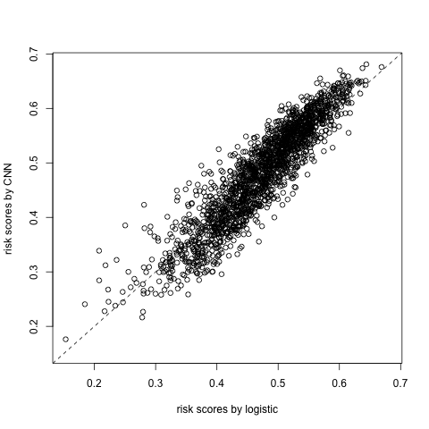
<p class="caption">(\#fig:factor-vs)Comparison of risk scores</p>
</div>

## Sensitivity analysis and conclusions

Since our portfolio is very small, we conduct a sensitivity analysis to test the robustness of our results.
Similar to cross-validation, we repeat the above analysis for 5 times and evaluate test Poisson loss on 5 mutually exclusive test data sets.
The results are shown in Table \@ref(tab:sens).


Table: (\#tab:sens)test Poisson loss for different data partitions

| test_index|   homo|    glm|    cnn|  alt_1|  alt_2|
|----------:|------:|------:|------:|------:|------:|
|          1| 1.1095| 1.0981| 1.0933| 1.0773| 1.0961|
|          2| 1.1003| 1.0306| 1.0287| 1.0379| 1.0284|
|          3| 1.0949| 1.0641| 1.0429| 1.0190| 1.0375|
|          4| 1.0952| 1.0721| 1.0656| 1.0837| 1.0624|
|          5| 1.0996| 1.0318| 1.0269| 1.1082| 1.0263|

We conclude with the following findings:

- Including the telematics car driving data can improve the predictive power of the claims frequency model.

- The two simpler alternatives have an equivalent good predictive performance as the 1D CNN approach.

- The advantage of the 1D CNN in the classification of archetypal trips seems having no effect on the claims frequency modeling based on our data. 

<!-- Typically, increasing the number of archetypal drivers will increase the robustness of the results. -->
<!-- If one cannot obtain a good classification during the CNN calibration, one should change the selected archetypal drivers. -->
<!-- The reason is that we select the archetypal drivers based on  ``guess'' rather than that they are truly safe or risky drivers. -->

